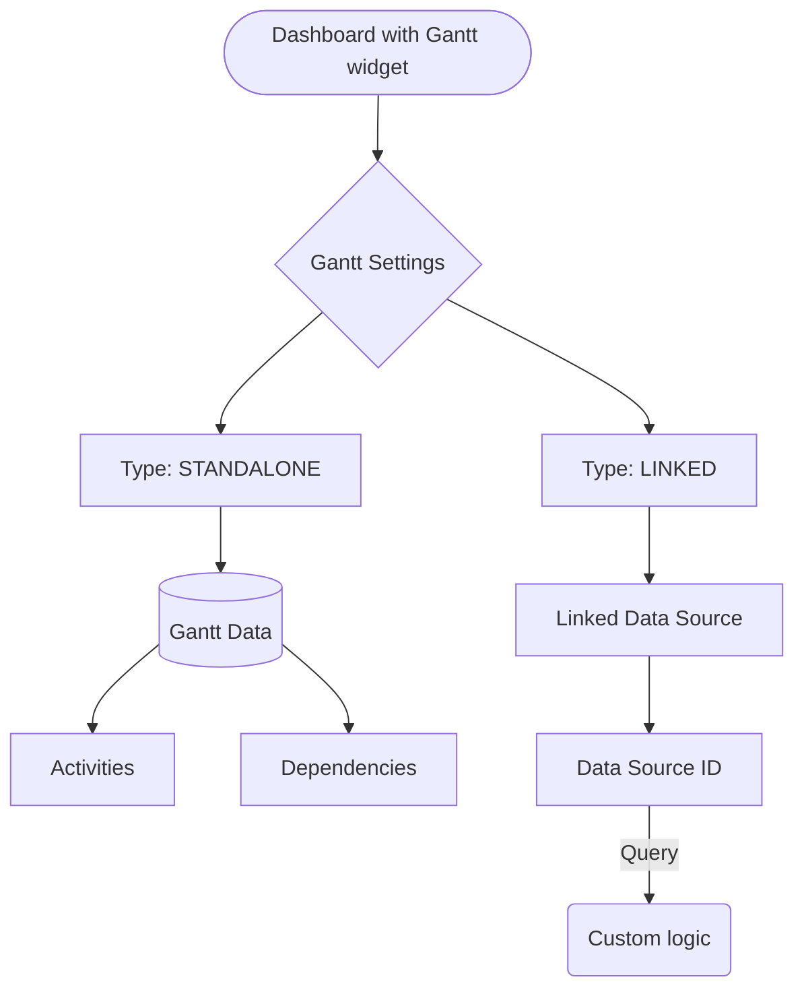
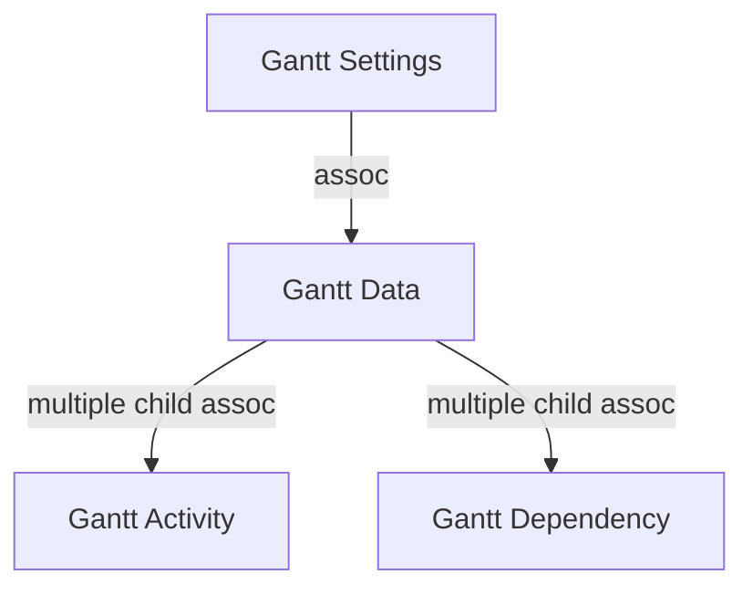

# Диаграмма Ганта

На фронтэнде используется библиотека [Svar React Gantt](https://svar.dev/react/gantt/).

На бэкенде настройки диаграммы сохраняются в `emodel/gantt-settings` dao, которая связана с `emodel/gantt-data`.

**Схема данных**

Виджет диаграммы можно добавлять на различные дашборды - рабочее пространство, тип данных, при этом, на один дашборд
можно добавить несколько виджетов с разными настройками.

## Добавление и настройка диаграммы

При добавлении виджета на дашборд, пользователь может выбрать одну из настроенных диаграмм Ганта ранее,
либо создать новую.

При создании новой диаграммы, пользователь может настроить следующие параметры:

### Тип данных диаграммы

**dataType** - Тип данных диаграммы, выбор из значений:

- `STANDALONE` - автономная диаграмма, все данные вводятся вручную
- `LINKED` - связь с бизнес-объектом, построение и работа диаграммы происходит на основе данных бизнес-объекта,
  связанных по источнику данных (sourceId)

### Если выбран тип `LINKED`, то дополнительно можно настроить:

#### Источник данных

Выбор источника данных, к которому необходимо обращаться для получения и сохранения данных диаграммы.
Доступно _ручное значение_ или _выбор из доступных_. На форме выбор одного, должен исключать выбор другого.

**dataSourceId** - Источник данных, выбор из существующих источников:

- `ecos-project-tracker/gantt-project-management` - Управление проектами

**manualDataSourceId** - Источник данных, ввод вручную. Текстовое поле.

#### Параметры построения диаграммы

**linkedWithType** - Тип данных, на основе которого будет строиться диаграмма, выбор из журнала типов данных.

**linkedWithRef** - RecordRef документа, на основе которого будет строиться диаграмма. Текстовое поле.

Поля `linkedWithType` и `linkedWithRef` используются для случая, когда диаграмма Ганта добавляется на любой дашборд,
но при этом должна строиться на основе определенных данных.

При добавлении на дашборд диаграммы, необходимо создать объект `emodel/gantt-settings` и сохранить на него ссылку в
дашборде.

[Пример запроса по созданию gant-settings](./gantt-settings-create.http)

### Ручной ввод данных

Пользователь настраивает диаграмму полностью сам - создает задачи, связи, при этом на бэкенд отправляются запросы
мутации.

Объект `emodel/gantt-settings` содержит ассоциацию к данным диаграммы - `emodel/gantt-data`, атрибут `data`.

Объект `emodel/gantt-data` содержит множественные дочерние ассоциации на объекты `emodel/gantt-activity` (
`timeline:activities`)
и `emodel/gantt-dependency` (`timeline:dependencies`).

| Entity     | Описание Svar React Gantt                                                                | Атрибуты                        | Пример Records API                                       |
|------------|------------------------------------------------------------------------------------------|---------------------------------|----------------------------------------------------------|
| Activity   | [Task description in svar-gantt](https://docs.svar.dev/react/gantt/api/properties/tasks) | Смотри аспект `activity-atts`   | [Create/Edit Activity](./gantt-activity-create.http)     |
| Dependency | [Link description in svar-gantt](https://docs.svar.dev/react/gantt/api/properties/links) | Смотри аспект `dependency-atts` | [Create/Edit Dependency](./gantt-dependency-create.http) |

### Вычисляемые данные

При выборе типа диаграммы `LINKED`, данные для диаграммы будут получаться из источника данных,
указанного в `dataSourceId` или `manualDataSourceId`.

При загрузке диаграммы, на сервер должен отправить query запрос на получение данных диаграммы, обязательно при каждом query
необходимо передавать информацию:

- `linkedWithType`
- `linkedWithRef`
- `currentRef` - recordRef текущего документа
- `workspace` - текущий workspace

[Пример запроса по получению данных диаграммы c linked sourceId](./gantt-linked-query.http)

В ответе в атрибутах `activities` и `dependencies` должны быть возвращены массивы данных для построения диаграммы.
Дальнейшая работа должна осуществляться с этими объектами.
